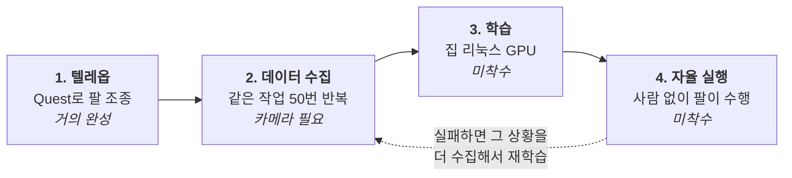
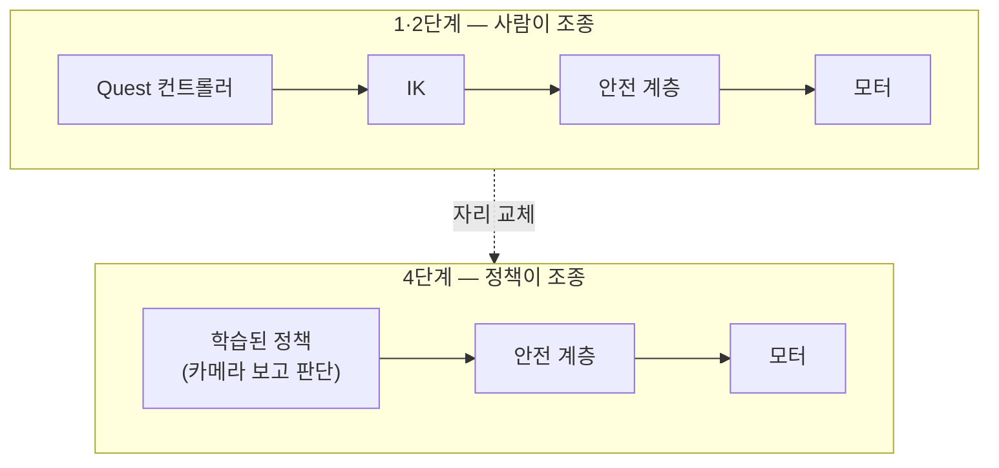
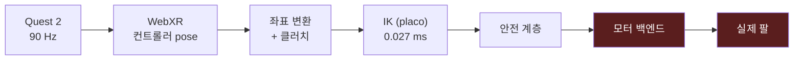
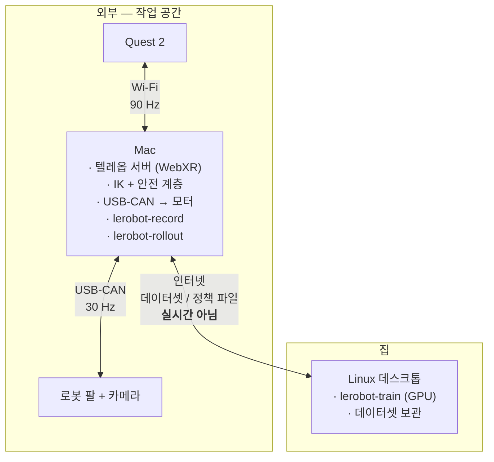

# 전체 파이프라인 — 조종부터 학습까지

작성일: 2026-08-01

---

## 0. 한 문장 요약

**사람이 Quest로 팔을 조종해서 "정답 시범"을 여러 번 보여주고, 그 기록으로 신경망을
학습시켜서, 나중에는 사람 없이 팔이 스스로 같은 일을 하게 만든다.**

이게 모방학습(imitation learning)이다. 로봇에게 규칙을 프로그래밍하는 게 아니라,
잘하는 걸 여러 번 보여주면 따라 하도록 만드는 방식이다.

---

## 1. 네 단계



핵심은 **4단계가 1단계와 같은 배선을 쓴다**는 것이다. 텔레옵에서 사람이 있던 자리에
학습된 정책(policy)이 들어앉을 뿐이다.



안전 계층과 모터 구간을 공들여 만든 이유가 이것이다. **두 번 쓴다.**

---

## 2. 1단계 — 텔레옵 (현재 위치)

### 지금 동작하는 것



| 구간 | 상태 | 실측 |
|---|---|---|
| Quest 입력 | ✅ | 90.1 Hz, 양손 전체 버튼 매핑 확정 |
| 좌표 변환 + 클러치 | ✅ | 미러/yaw 실시간 조절 가능 |
| IK | ✅ | 0.027 ms, 연속 추종 p95 **0.09 mm** |
| 안전 계층 | ✅ | 소프트스타트·속도제한·워치독·괴리제한 |
| **모터 백엔드** | ❌ | **하드웨어 담당자 인수인계 중** |

### 조작 방식

| 입력 | 동작 |
|---|---|
| 오른손 **Grip** | 누르는 동안만 팔이 따라옴 (clutch). 떼면 정지, 다시 잡으면 이어서 |
| 오른손 **위치·자세** | 팔 EE 목표 (사람 손 변위 × 0.706) |
| 오른손 **Trigger** | Amazing Hand 쥐는 정도 (예정) |
| 왼손 **X / Y** | 좌표 매핑 조절 (미러 / yaw) |

> **클러치가 핵심이다.** 사람 팔은 어깨에 묶여 있어 가동범위가 좁다. Grip을 뗐다가
> 편한 자세에서 다시 잡으면 기준이 새로 잡히므로, 마우스를 들었다 놓는 것처럼
> 로봇을 계속 움직일 수 있다.

---

## 3. 2단계 — 데이터 수집

### ⚠️ 여기서 카메라가 필요하다

**아직 카메라 이야기를 안 했는데, 모방학습에는 필수다.**

정책이 자율 실행할 때 판단 근거는 **카메라 영상**뿐이다. 관절각만으로 학습하면
"항상 똑같은 궤적을 재생"하는 것밖에 못 한다. 물건이 조금만 다른 위치에 있어도 실패한다.

일반적인 구성 (LeRobot 표준):

| 카메라 | 위치 | 역할 |
|---|---|---|
| **front** | 작업대 정면 고정 | 전체 상황, 물체 위치 |
| **wrist** | 손목에 장착 | 파지 순간의 세밀한 정렬 |

USB 웹캠 2대면 충분하다 (640×480 @ 30 fps). 손목 카메라가 성능 차이를 크게 만든다.

### 수집 과정

```bash
lerobot-record \
  --robot.type=<우리 팔> \
  --robot.cameras="{front: {type: opencv, index_or_path: 0, width: 640, height: 480, fps: 30}, \
                    wrist: {type: opencv, index_or_path: 1, width: 640, height: 480, fps: 30}}" \
  --teleop.type=<우리 XR 텔레옵> \
  --dataset.repo_id=<계정>/pick-cube \
  --dataset.single_task="Pick up the red cube and put it in the box" \
  --dataset.num_episodes=50 \
  --dataset.episode_time_s=30
```

한 에피소드 = 작업 한 번 (예: 큐브 하나 집어서 상자에 넣기, 약 20~30초).
이걸 **50번 정도** 반복한다. 매번 물체 위치를 조금씩 바꿔야 정책이 일반화된다.

녹화 중 키: `→` 다음 에피소드 / `←` 재녹화 / `Esc` 종료
(→ 헤드셋을 쓴 채 조작하려고 왼손 버튼에 이 기능을 배정할 예정)

### 저장되는 것

매 프레임(30 Hz)마다:

| 항목 | 내용 |
|---|---|
| `observation.images.front` | 정면 카메라 이미지 |
| `observation.images.wrist` | 손목 카메라 이미지 |
| `observation.state` | 현재 관절각 5개 (+ 나중에 손 8개) |
| `action` | 그 순간 사람이 지령한 목표 관절각 |
| `task` | "Pick up the red cube..." (자연어 지시) |

30초 × 30 Hz × 50 에피소드 ≈ **45,000 프레임**. 영상 포함 수 GB 규모.
저장 위치: `~/.cache/huggingface/lerobot/<repo_id>`

> 학습이 배우는 것은 결국 **"이 화면이 보일 때 관절을 이렇게 움직여라"** 라는 대응 관계다.

---

## 4. 3단계 — 학습 (집 리눅스 GPU)


**여기가 집 리눅스 데스크톱의 제자리다.** 학습은 실시간성이 전혀 필요 없고 GPU를
오래 쓰므로, 인터넷 지연이 문제되지 않는다.

```bash
lerobot-train \
  --dataset.repo_id=<계정>/pick-cube \
  --policy.type=act \
  --output_dir=outputs/train/act_pick_cube \
  --policy.device=cuda
```

### 정책 종류

| 정책 | 특징 | 언제 |
|---|---|---|
| **ACT** | 가볍고 빠르게 수렴. 단일 작업에 강함 | **처음엔 이걸로** |
| Diffusion Policy | 부드러운 궤적, 다중 모드 대응 | ACT가 부족할 때 |
| SmolVLA / π0 | 사전학습된 VLA. 자연어 지시 이해 | 여러 작업을 하나로 |

소요 시간: ACT 기준 50 에피소드면 GPU에서 **수 시간** 정도.

---

## 5. 4단계 — 자율 실행

```bash
lerobot-rollout \
  --policy.path=<계정>/my-policy \
  --robot.type=<우리 팔> \
  --robot.cameras="{...}" \
  --task="Pick up the red cube and put it in the box"
```

정책이 카메라를 보고 30 Hz로 관절각을 뱉는다. **텔레옵과 똑같이 안전 계층을 거쳐**
모터로 간다. 사람은 비상정지만 잡고 지켜본다.

잘 안 되면 → 실패하는 상황을 더 수집해서 재학습 (2단계로 돌아감).
이 반복이 정상이고, 보통 몇 사이클 돈다.

---

## 6. 어디서 무엇이 도는가



**실시간 루프(30 Hz)는 전부 Mac 안에서 닫힌다.** 인터넷을 건너지 않는다.
집 리눅스와는 파일만 주고받으므로 지연이 문제되지 않는다.

> 원격 조종을 시도하실 경우에도 IK·안전 계층은 Mac 로컬에 두고 EE 목표만 보낸다.
> 그래야 네트워크가 끊겨도 Mac의 워치독(0.5초)이 로컬에서 팔을 세운다.

---

## 7. 남은 일

| # | 항목 | 상태 | 막고 있는 것 |
|---|---|---|---|
| 1 | **모터 백엔드** | 인수인계 중 | 모터 모델명, USB-CAN의 slcan 지원 여부 |
| 2 | **시운전** | 대기 | 1번. 관절 하나씩 방향·영점 실측 |
| 3 | **카메라** | **미논의** | 웹캠 2대 (정면 + 손목), 손목 마운트 |
| 4 | LeRobot Robot/Teleoperator 래핑 | 미착수 | 1번이 끝나면 바로 가능 |
| 5 | 데이터 수집 | 미착수 | 1·3번 |
| 6 | 학습 환경 | 미확인 | 집 리눅스 GPU 사양 |
| 7 | Amazing Hand | 후순위 | 커넥터 실측, 손 URDF |

### 지금 당장 할 수 있는 것

- **카메라 결정** — 이건 모터와 무관하게 지금 정할 수 있고, 준비 기간이 필요하다
  (손목 마운트를 3D 프린팅해야 할 수도 있음)
- **집 리눅스 GPU 사양 확인** — VRAM 8 GB 이상이면 ACT는 무난하다
- **작업 정하기** — 무엇을 시킬지가 정해져야 카메라 배치와 에피소드 설계가 나온다
  (예: "책상 위 큐브를 집어 상자에 넣기")

---

## 8. 자주 나오는 오해

**"팔이 궤적을 외우는 건가요?"**
아니다. 카메라 영상 → 관절 지령의 **대응 관계**를 배운다. 그래서 물체가 다른 위치에
있어도 대응할 수 있다. 단, 학습 때 본 적 없는 상황에는 약하다.

**"에피소드 50개면 충분한가요?"**
단순한 작업(집어서 옮기기)은 대체로 충분하다. 조명·배경·물체 위치를 다양하게 하면
적은 수로도 잘 되고, 매번 똑같이 하면 100개를 모아도 일반화가 안 된다.

**"조종이 서툴러도 되나요?"**
정책은 사람의 조작을 그대로 따라 배운다. 머뭇거림과 실수까지 배운다.
**깔끔하고 일관되게 조작하는 게 데이터 품질**이다. 망친 에피소드는 `←`로 다시 찍는 게 낫다.
